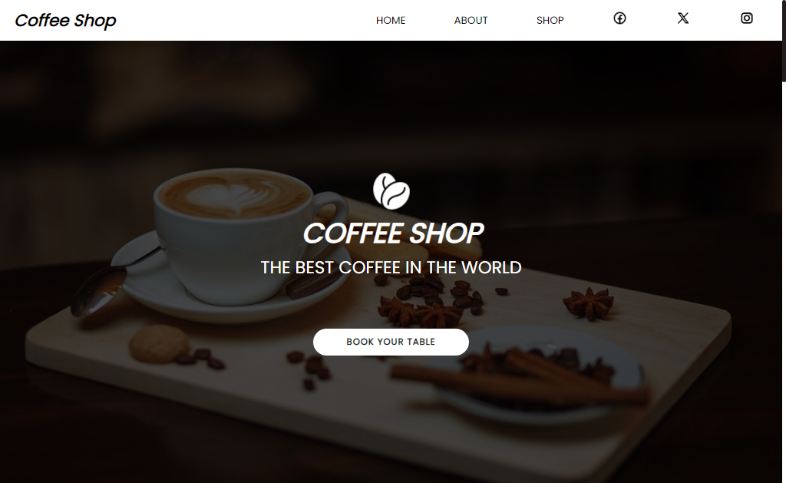

# Coffee Shop

> Shop

Esse é um projeto criado para um cafeteria. 

[Clique para acessar](https://coffee-shop-omega-gold.vercel.app/)

## 🚀 Tecnologias

- ReactJS
- TypeScript

## 💻 O que aprendi

- Aprendi a criar um campo de busca que filtra os produtos
- Aprendi a fazer um carrinho de produtos
- Aprendi a usar a biblioteca Swiper para criar slides
- Adquiri mais conhecimentos em TypeScript

## 📨 Contato

- guilhermemillerblack@gmail.com